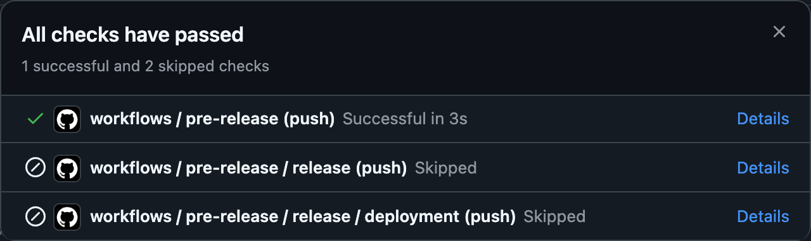
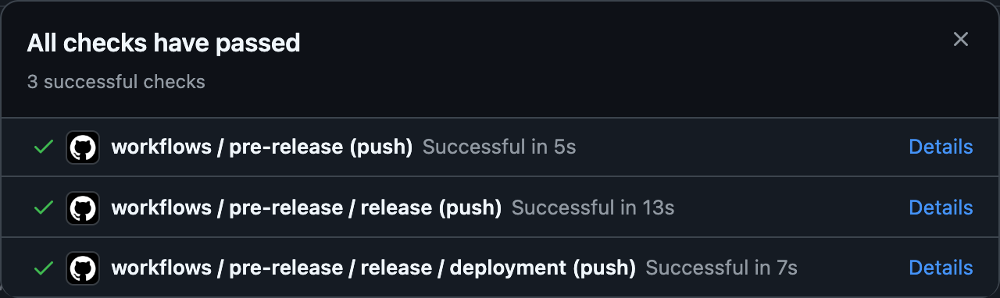

# Release Workflow Documentation

This document provides detailed instructions on using the provided workflow for automated deployment.

## **Workflow Overview**

The workflow is triggered on a `push` to the `main` branch. It consists of three jobs:

1. **Pre-Release**: Checks for version changes.

2. **Release**: Creates a GitHub release. `(This job only runs if a version change is detected)`

3. **Deployment**: Deploys to a remote VPS via SSH and rsync. `(This job only runs if a version change is detected)`

## **Secrets Required**

To use the workflow, the following secrets must be configured in your repository:

| Secret Name                | Description                                                        |
| -------------------------- | ------------------------------------------------------------------ |
| `GITHUB_TOKEN`             | Automatically provided by GitHub for authentication in workflows.  |
| `SSH_PRIVATE_KEY`          | SSH private key for authenticating with the remote VPS.            |
| `VPS_USER`                 | The username to connect to the VPS.                                |
| `VPS_HOST`                 | The hostname or IP address of the VPS.                             |
| `VPS_DEPLOYMENT_DIRECTORY` | The directory on the VPS where the application should be deployed. |

## **Changelog Format**

The workflow extracts release notes from the `CHANGELOG.md` file. For this to work, the changelog must use the following format:

```md
## [v0.0.0] - 1970-01-01

### Added

- ✨ Feature or functionality added.

### Changed

- ⚙️ Changes made to existing functionality.

### Deprecated

- ⏳ Features marked for deprecation.

### Removed

- ❌ Features or functionality removed.

### Fixed

- 🐛 Bugs fixed.

### Security

- 🔒 Security improvements or fixes.
```

## **Examples**

|                    |                                  |
| :----------------------------------------------------------------------------------: | :------------------------------------------------------------------------------------------------: |
| A push to main with no version change. The release and deployment steps are skipped. | A push to main with a version change. The workflow proceeds with the release and deployment steps. |
